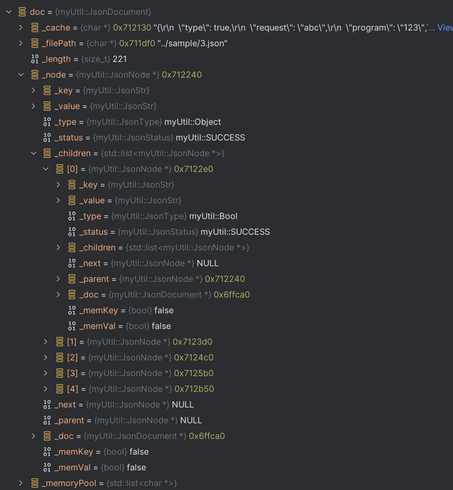

<strong>声明：</strong>新的JsonParse是依靠stl完成的，与JsonSerialize类没有任何关系
<br><br>
所有的数据均存储在JsonDocument中，包括后来添加的数据，如新的key:value，JsonNode和JsonStr中只存储数据的char指针<br>
整个文件的解析是使用JsonNode类的递归Load完成的(包括转对象)
<br><br>
数据结构如下图(使用clion查看内部的数据结构)：
<br>

<br>

### 使用方式:

* 保存

```c++
JsonDocument doc("../sample/test.json");
cout << doc.getNode().getStatus() << endl;
doc.save("3.json");
```

* 增加

```c++
auto node = doc.CreateNode(String);
node->setKey("abc", 3);
node->setValue("123", 3);
doc.getNode().addChild(node);
```

* []重载

```c++
auto b = doc.getNode()[0];
b.getString(cout);
auto a = doc.getNode()["configurations"][0]["name"];
cout << a.toString() << endl;
```

* 转对象(使用反射)

```c++
class A : public RObject {
public:
    bool type;
    string request;
    string program;
    B* abc;
    C* bcd;
};
REGISTER_REFLEX(A)
REGISTER_REFLEX_FIELD(A, bool, type)
REGISTER_REFLEX_FIELD(A, string, request)
REGISTER_REFLEX_FIELD(A, string, program)
REGISTER_REFLEX_FIELD(A, B, abc)
REGISTER_REFLEX_FIELD(A, C, bcd)
JsonDocument doc("../sample/3.json");
cout << doc.getNode().getStatus() << endl;
auto a = (A*)doc.getNode().toRObject("A", "B", "C");
```

<table>
<caption>枚举</caption>
<tbody align="center" valign="center">
<tr>
<th colspan="2">类型枚举</th>
<th colspan="2">错误枚举</th>
</tr>
<tr>
    <td>名称</td>
    <td>意义</td>
    <td>名称</td>
    <td>意义</td>
</tr>
<tr>
    <td>None</td>
    <td>无</td>
    <td>SUCCESS</td>
    <td>成功</td>
</tr>
<tr>
    <td>Number</td>
    <td>数字</td>
    <td>ERROR_FILE_READ</td>
    <td>文件读取失败</td>
</tr>
<tr>
    <td>String</td>
    <td>字符串</td>
    <td>ERROR_FORMAT</td>
    <td>json格式错误</td>
</tr>
<tr>
    <td>Array</td>
    <td>数组</td>
    <td>ERROR_NULLPTR</td>
    <td>出现空指针</td>
</tr>
<tr>
    <td>Bool</td>
    <td>布尔</td>
</tr>
<tr>
    <td>Null</td>
    <td>空</td>
</tr>
<tr>
    <td>Object</td>
    <td>对象</td>
</tr>
</tbody>
</table>
